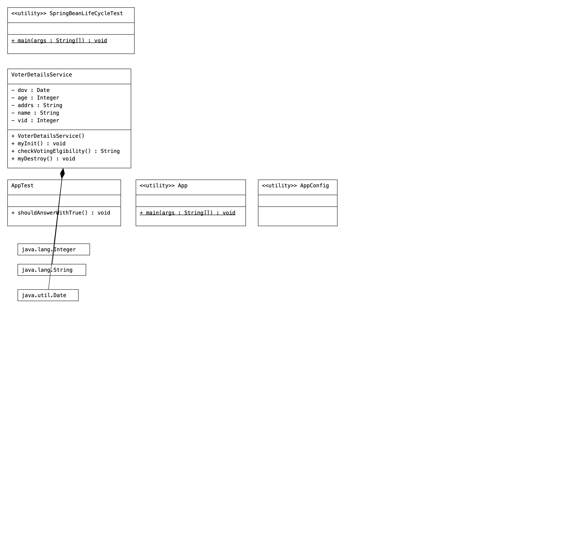

# IOCProj11-SpringBeanLifecycle-Annotations

# code

```Java
//AppConfig.java
package com.voter.config;

import org.springframework.context.annotation.ComponentScan;
import org.springframework.context.annotation.Configuration;
import org.springframework.context.annotation.PropertySource;

@Configuration
@ComponentScan(basePackages = "com.nt.sbeans")
@PropertySource("com/voter/commons/Info.properties")
public class AppConfig {

}
package com.voter.main;

/**
 * Hello world!
 *
 */
public class App
{
    public static void main( String[] args )
    {
        System.out.println( "Hello World!" );
    }
}
package com.voter.main;

import org.springframework.context.annotation.AnnotationConfigApplicationContext;

import com.voter.config.AppConfig;
import com.voter.sbeans.VoterDetailsService;

public class SpringBeanLifeCycleTest {

    public static void main(String[] args) {
        //create IOC container
        AnnotationConfigApplicationContext ctx=new AnnotationConfigApplicationContext(AppConfig.class);
        //get Spring Bean
        VoterDetailsService service=ctx.getBean("voter",VoterDetailsService.class);
        //invoke the b.method
        String result=service.checkVotingElgibility();
        System.out.println(result);

        //close the container
        ctx.close();

    }
}
package com.voter.sbeans;

import java.util.Date;

import org.springframework.beans.factory.annotation.Value;
import org.springframework.stereotype.Component;

import jakarta.annotation.PostConstruct;
import jakarta.annotation.PreDestroy;

@Component("voter")
public class VoterDetailsService {
    @Value("${voter.id}")
    private  Integer vid;
    @Value("${voter.name}")
    private  String   name;
    @Value("${voter.addrs}")
    private  String  addrs;
    @Value("${voter.age}")
    private   Integer age;
    private  Date dov;

    public VoterDetailsService() {
        System.out.println("VoterDetailsService:: 0-param constructor");
    }

    //custom init method
    @PostConstruct
    public   void myInit() {
        System.out.println("VoterDetailsService.myInit()");
        //check weather important  properties are injected with correct values or not
        if(name==null || name.length()==0 || name.equals("") || age==null || age<=0)
            throw new IllegalArgumentException(" PErson name, age are not given  properly");
        // initialize left over properties
        dov=new Date();
    }


    public   String  checkVotingElgibility() {
        System.out.println("VoterDetailsService.checkVotingElgibility()");
        if(age<18)
            return "Mr./Miss/Mrs."+name+" u  r  not elgible for voting --> verified on ::"+dov;
        else
            return "Mr./Miss/Mrs."+name+" u  r   elgible for voting---> verified on ::"+dov;
    }

    @PreDestroy
    public   void myDestroy() {
        System.out.println("VoterDetailsService.myDestroy()");
        name=null;
        age=null;
        addrs=null;
        dov=null;
        vid=null;
    }


}
```

# Properties
```properties
#Voter  information
voter.id=1001
voter.name=raja
voter.addrs=hyd
voter.age=20
```

# Dependencies
```xml
    <dependencies>
        <dependency>
            <groupId>junit</groupId>
            <artifactId>junit</artifactId>
            <version>4.11</version>
            <scope>test</scope>
        </dependency>
        <!-- https://mvnrepository.com/artifact/org.springframework/spring-context-support -->
        <dependency>
            <groupId>org.springframework</groupId>
            <artifactId>spring-context-support</artifactId>
            <version>6.1.5</version>
        </dependency>
        <!-- https://mvnrepository.com/artifact/jakarta.annotation/jakarta.annotation-api -->
        <dependency>
            <groupId>jakarta.annotation</groupId>
            <artifactId>jakarta.annotation-api</artifactId>
            <version>2.1.1</version>
        </dependency>
    </dependencies>
```
# UML
